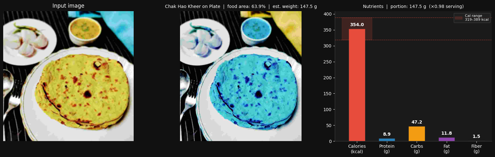
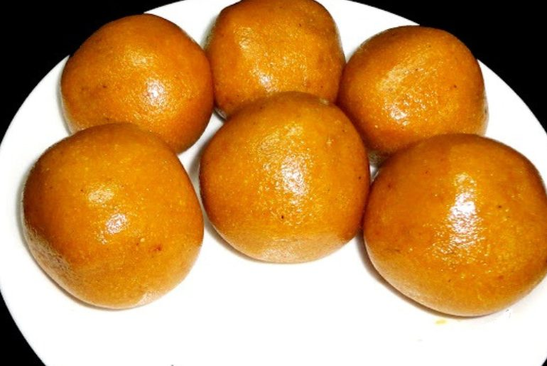

# Calorie Lens: Indian Food Calorie and Nutrient Estimator

A computer vision pipeline that identifies Indian food items from a single photograph, estimates portion size using instance segmentation, and outputs calorie and macronutrient values scaled to the actual serving weight.

---

## Table of Contents

- [Overview](#overview)
- [Pipeline Architecture](#pipeline-architecture)
- [Models](#models)
- [Dataset](#dataset)
- [How Portion Size Is Estimated](#how-portion-size-is-estimated)
- [Output](#output)
- [Screenshots](#screenshots)
- [Project Structure](#project-structure)
- [Setup and Usage](#setup-and-usage)
- [Configuration](#configuration)
- [Limitations](#limitations)

---

## Overview

Given a photo of an Indian dish served on a plate or in a bowl, the system:

1. Classifies the food item (51 classes of Indian cuisine)
2. Detects whether the vessel is a plate or bowl
3. Segments the food region using instance segmentation
4. Computes the food-to-vessel area ratio to estimate portion weight
5. Scales per-100g nutritional values from a curated CSV to the estimated portion

The result is a structured JSON output and a formatted console report showing calories, protein, carbohydrates, fat, and fiber with a confidence-based calorie uncertainty range.

---

## Pipeline Architecture

```
Input Image
    |
    v
[Food Classifier]          ResNet50 fine-tuned on 51 Indian food classes
    |                      Output: food_name, confidence
    v
[Vessel Classifier]        EfficientNetB4 binary classifier (plate vs bowl)
    |                      Output: vessel_type (plate / bowl)
    v
[Mask R-CNN]               COCO-pretrained instance segmentation
    |                      Output: food_mask, vessel_mask, area_fraction
    v
[Weight Estimator]         area_fraction / expected_fill * avg_serving_g
    |                      Output: weight_g
    v
[Nutrient Calculator]      Lookup CSV, scale per-100g values to weight_g
    |                      Output: calories, protein, carbs, fat, fiber
    v
JSON result + console report
```

---

## Models

### Food Classifier

| Property | Detail |
|---|---|
| Architecture | ResNet50 with custom classification head |
| Input size | 224 x 224 |
| Number of classes | 51 |
| Preprocessing | `tf.keras.applications.resnet.preprocess_input` |
| Framework | TensorFlow / Keras |
| Confidence threshold | 0.40 |
| Final validation accuracy | ~72% (15 epochs) |

The model was trained on a custom scraped dataset of Indian food images. Training used transfer learning with the ResNet50 backbone initially frozen, then progressively unfrozen for fine-tuning.

### Vessel Classifier

| Property | Detail |
|---|---|
| Architecture | EfficientNetB4 (EfficientNetV2B3 on Kaggle training run) |
| Input size | 224 x 224 |
| Number of classes | 2 (food\_in\_plate, food\_in\_bowl) |
| Preprocessing | Pixel normalization to [0, 1] |
| Framework | TensorFlow / Keras |
| Confidence threshold | 0.50 |
| Final validation accuracy | ~92% |

Training used `MirroredStrategy` on dual T4 GPUs on Kaggle. Key training fixes included gradient clipping (`clipnorm=1.0`) to prevent NaN loss, and lazy loading to avoid OOM on the local RTX 3050 (4 GB VRAM).

### Segmentation Model

| Property | Detail |
|---|---|
| Architecture | Mask R-CNN with ResNet50-FPN backbone |
| Weights | COCO pretrained (`MaskRCNN_ResNet50_FPN_Weights.DEFAULT`) |
| Framework | PyTorch (torchvision) |
| Score threshold | 0.50 |
| Vessel COCO labels used | 47 (cup), 51 (bowl) |

The Mask R-CNN is not fine-tuned. It is used purely to segment the vessel region and the foreground food object within it. When no vessel mask is detected, a centered elliptical fallback region is used.

---

## Dataset

### Food Images

- 51 classes of Indian food
- Images scraped using `icrawler` from web sources
- Approximately 50 to 150 images per class after cleaning
- Classes include both North and South Indian dishes, sweets, breads, curries, and snacks

Full list of supported food classes:

`adhirasam`, `aloo_gobi`, `aloo_matar`, `aloo_methi`, `aloo_shimla_mirch`, `aloo_tikki`, `anarsa`, `ariselu`, `bandar_laddu`, `basundi`, `bhatura`, `bhindi_masala`, `biryani`, `boondi`, `butter_chicken`, `chak_hao_kheer`, `cham_cham`, `chana_masala`, `chapati`, `chicken_razala`, `chicken_tikka`, `chicken_tikka_masala`, `chikki`, `daal_baati_churma`, `daal_puri`, `dal_makhani`, `dal_tadka`, `dum_aloo`, `gajar_ka_halwa`, `gulab_jamun`, `jalebi`, `kadai_paneer`, `kadhi_pakoda`, `kofta`, `lassi`, `litti_chokha`, `makki_di_roti_sarson_da_saag`, `malapua`, `modak`, `mysore_pak`, `naan`, `palak_paneer`, `paneer_butter_masala`, `phirni`, `poha`, `rabri`, `ras_malai`, `rasgulla`, `shrikhand`, `sohan_papdi`, `unni_appam`

### Nutrient CSV

A manually curated CSV (`indian food calories dataset.csv`) with one row per food class containing:

| Column | Description |
|---|---|
| `food_name` | Normalized food name (snake\_case) |
| `calories_per_100g` | Caloric density |
| `protein_g` | Protein per 100 g |
| `carbs_g` | Carbohydrates per 100 g |
| `fat_g` | Fat per 100 g |
| `fiber_g` | Fiber per 100 g |
| `avg_serving_g` | Typical serving weight in grams |
| `calorie_uncertainty` | Fractional uncertainty used for calorie range (defaults to 0.15 if absent) |

---

## How Portion Size Is Estimated

Portion weight is derived from the ratio of food pixels to vessel pixels in the segmented image, calibrated against a known standard vessel size and an expected fill fraction.

**Step-by-step:**

1. Mask R-CNN segments the image and returns instance masks for all detected objects.
2. The vessel mask is identified using COCO label IDs 47 and 51 (cup and bowl). If no vessel is detected, a centered ellipse covering approximately 84% of the frame is used as a fallback.
3. The best food mask is selected as the highest-scoring non-vessel, non-background detection that overlaps at least 20% with the vessel region and covers at least 500 pixels.
4. The area fraction is computed as `food_pixels / vessel_pixels`, clamped to [0.05, 1.0].
5. Physical vessel dimensions are used as reference:
   - Plate: diameter 25 cm, usable area fraction 0.75
   - Bowl: diameter 15 cm, usable area fraction 0.85
6. The fill ratio is computed as `area_fraction / expected_fill`, where expected fill is 0.65 for plates and 0.80 for bowls.
7. Estimated weight is `avg_serving_g * fill_ratio`, with fill_ratio clamped to [0.15, 2.0].

The image below shows the masking output for a chapati on a plate. The blue overlay on the center panel marks the detected food region. The food area (63.9% of the vessel) drives the weight estimate of 147.5 g.



*Left: original input. Center: food mask overlay (Mask R-CNN). Right: estimated nutrient bar chart.*

---

## Output

### Console

```
==================================================
  chapati.jpg
==================================================
  Food        : Chak Hao Kheer  (conf: 98.0%)
  Est. Weight : 147.5 g
--------------------------------------------------
  Nutrient               Amount    Per 100g
  --------------------------------------------
  Calories (kcal)         354.0       240.0
  Protein (g)               8.9         6.0
  Carbohydrates (g)        47.2        32.0
  Fat (g)                  11.8         8.0
  Fiber (g)                 1.5         1.0
--------------------------------------------------
  Cal/g       : 2.4 kcal/g
  Calorie range: 319.0 - 389.0 kcal  (+-10%)
==================================================
```

### JSON

A result file is saved to the `results/` directory:

```json
{
  "food": "chak_hao_kheer",
  "food_conf": 0.98,
  "weight_g": 147.5,
  "area_fraction": 0.639,
  "nutrients": {
    "calories_kcal": 354.0,
    "calories_range": [319.0, 389.0],
    "cal_per_g": 2.4,
    "protein_g": 8.9,
    "carbohydrates_g": 47.2,
    "fat_g": 11.8,
    "fiber_g": 1.5
  }
}
```

---

## Screenshots

**Sample dataset images**


**Food classifier training curves (ResNet50)**


**Vessel classifier training curves (EfficientNetB4)**


**Pipeline output: Aloo Methi**

<table>
  <tr>
    <td align="center"><b>Input</b></td>
    <td align="center"><b>Output</b></td>
  </tr>
  <tr>
    <td></td>
    <td></td>
  </tr>
</table>

**Pipeline output: Laddu**

<table>
  <tr>
    <td align="center"><b>Input</b></td>
    <td align="center"><b>Output</b></td>
  </tr>
  <tr>
    <td></td>
    <td></td>
  </tr>
</table>

**Full pipeline output with Mask R-CNN overlay**


---

## Project Structure

```
.
├── food_estimator.py                    # Main pipeline script
├── inference.py                         # Standalone inference script
├── indian food calories dataset.csv     # Nutrient reference data
├── images/                              # Screenshots and result images
│   ├── masking.png
│   ├── dataset sample images.png
│   ├── food classification model result.png
│   ├── vessel classification model result.png
│   ├── aloo methi output.png
│   ├── aloo methi.png
│   ├── laddu output.png
│   └── laddu.png
├── test images/                         # Sample images for testing
├── final_model/
│   ├── food_model_resnet.keras          # Trained food classifier
│   └── plate_vs_bowl_model.keras        # Trained vessel classifier
├── results/                             # JSON outputs saved here
├── food_classification_kaggle.ipynb     # Food classifier training
├── food_detection_notebook.ipynb        # Segmentation experiments
└── scrapping_dishes_image.ipynb         # Image scraping pipeline
```

---

## Setup and Usage

### Requirements

```
Python >= 3.9
TensorFlow >= 2.12
PyTorch >= 2.0
torchvision
opencv-python
Pillow
pandas
numpy
matplotlib
```

Install dependencies:

```bash
pip install tensorflow torch torchvision opencv-python pillow pandas numpy matplotlib
```

### Running

```bash
python food_estimator.py
```

When prompted, enter the full path to the food image. The script loads all three models, runs the pipeline, prints the nutrient report to the console, and saves a JSON result to `results/`.

### GPU Memory Note

The pipeline loads TensorFlow (food and vessel models) and PyTorch (Mask R-CNN) into the same GPU. On cards with less than 6 GB VRAM, TensorFlow memory growth is enabled automatically. Mask R-CNN is loaded lazily after both Keras models are done predicting to reduce peak VRAM usage. If OOM errors occur, run with `CUDA_VISIBLE_DEVICES=-1` to force CPU inference.

---

## Configuration

All key parameters are defined as constants at the top of `food_estimator.py`:

| Constant | Default | Description |
|---|---|---|
| `FOOD_IMG_SIZE` | (224, 224) | Input resolution for food classifier |
| `VESSEL_IMG_SIZE` | (224, 224) | Input resolution for vessel classifier |
| `FOOD_CONF_THRESH` | 0.40 | Minimum confidence to accept food prediction |
| `VESSEL_CONF_THRESH` | 0.50 | Minimum confidence for vessel classification |
| `VESSEL_DIMS` | see code | Physical dimensions (cm) for plate and bowl |
| `EXPECTED_FILL` | plate: 0.65, bowl: 0.80 | Expected food-to-vessel area ratio at a standard serving |
| `VESSEL_LABELS` | {47, 51} | COCO label IDs treated as the reference vessel |
| `EXCLUDE_LABELS` | {0, 62, ...} | COCO labels excluded from food mask selection |

---

## Limitations

- Food classification accuracy is approximately 72% on the validation set. Misclassification directly affects nutrient values since all nutrient lookup is by predicted food name.
- Portion estimation assumes a standard plate (25 cm diameter) or bowl (15 cm diameter). Unusual vessel sizes will produce inaccurate weight estimates.
- The Mask R-CNN is COCO-pretrained and was not fine-tuned on Indian food or Indian tableware. Vessel detection may fail on uncommon vessel types, triggering the elliptical fallback.
- The nutrient CSV contains manually curated average values. Actual nutrient content varies with recipe and cooking method.
- The system handles only single-dish images. Mixed plates with multiple food items are not supported.
